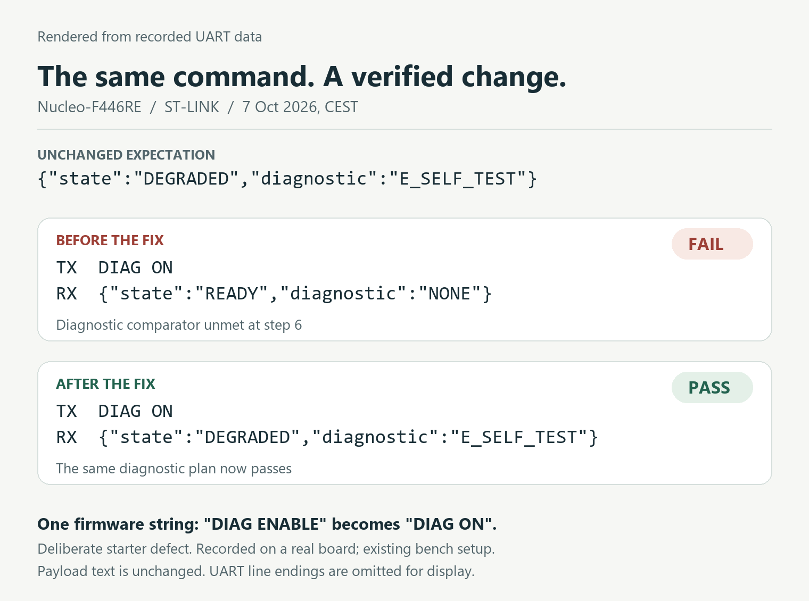
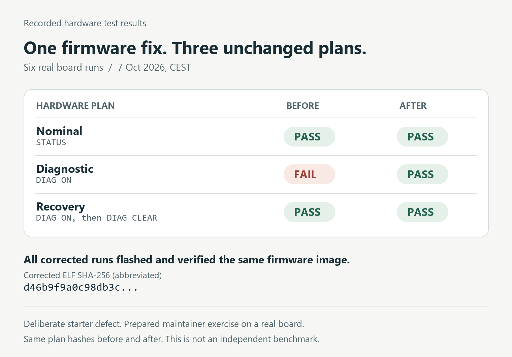

# Codex MCP run with real board feedback, 2026-10-07

Agentic Hardware-in-the-Loop (Agentic HIL) let a Codex CLI agent run three existing hardware test plans on a real ST Nucleo-F446RE through the local MCP server, inspect a failed diagnostic response, correct one firmware line, rebuild, and rerun the same plans.

This is a prepared maintainer exercise on an already configured bench. The diagnostic defect was deliberate. It is not an independent benchmark, a fresh installation test, or physical fault injection. These artifacts document one bounded run, not general autonomous performance. No new hardware run was made to publish this package.

## Result

| Unchanged plan | Initial firmware | Corrected firmware |
| --- | --- | --- |
| Nominal | PASS | PASS |
| Diagnostic | FAIL | PASS |
| Recovery | PASS | PASS |

The initial firmware recognized `DIAG ENABLE`, while the declared protocol and diagnostic plan sent `DIAG ON`. The UART evidence records the initial response without the expected diagnostic, followed by `DEGRADED` and `E_SELF_TEST` after the correction. [The firmware diff](evidence/firmware.diff) changes only that command match. The plans were not weakened to pass.

Recorded on 7 October 2026 in Europe/Berlin (CEST), which was 6 October in UTC. Agentic HIL version: **0.21.4**, debugger backend: **OpenOCD 0.12.0**, board: **Nucleo-F446RE**, probe: **ST-LINK**. Hardware plans were invoked with the MCP `test_reactor_run` tool. The package includes [selected session excerpts](session-excerpts.txt) and a [session tool index](session-tool-index.json) linking six MCP calls to the canonical report IDs. These are curated extracts, not a complete agent transcript or independent attestation.

Starting source: [c64484450bffbb73a29546334633c53e7fff9960](https://github.com/agentic-hil/stm32-starter/tree/c64484450bffbb73a29546334633c53e7fff9960).

All three corrected runs used the same ELF SHA-256:

```text
d46b9f9a0c98db3cc09cd6f2a1c45992f0fcee47545ed975fe8e388407928aac
```

## Inspect the evidence

- [Source map and SHA-256 manifest](evidence/source-map.json): maps all six runs to canonical reports and UART logs, records plan and firmware hashes, and distinguishes published-copy hashes from retained private-original hashes.
- [Canonical reports](evidence/canonical/): verdicts, flashed artifact hashes, comparisons and cleanup results.
- [UART JSONL records](evidence/logs/): recorded UART payload bytes.
- [Corrected build](evidence/build-corrected-nominal.json): compilation, linking, source and ELF hashes.
- [Evidence redaction notes](evidence/README.md): what was replaced and what was preserved.

Private host paths, executable paths, device paths and probe identifiers were replaced with explicit placeholders. UART payload bytes and test verdicts were preserved. No executable firmware, authoritative bench configuration, private article, or remote hardware endpoint is included.



*Rendered excerpts from the included UART records, not a screenshot or board photograph.*



*Rendered summary of the six included reactor reports.*

Verify each file against `published_copy_sha256` in the manifest. The original-private hashes identify retained originals and do not verify these redacted copies. Git stores this directory without newline normalization so published-copy hashes remain valid after checkout.

## Try the exercise

Follow the [starter README](../../README.md) for installation and the board-free plan checks. A hardware run requires your own Nucleo-F446RE and configured local bench. Start from the linked baseline to reproduce the deliberate defect, then use the unchanged three plans as the gate for your correction.

The [2026-09-15 Linux walkthrough](../2026-09-15-newcomer-linux/) is separate evidence of the CLI newcomer path. It is not this MCP recording.
